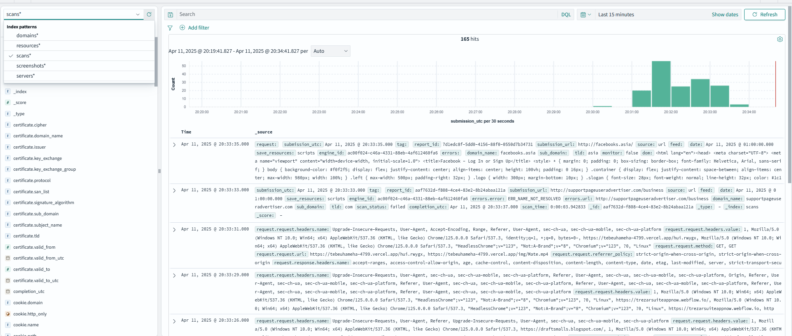

# Webamon Sandbox Stack - Opensource Private URL & Domain Scanner

## Overview

Webamon provides a simple, self-hosted stack for performing **comprehensive web scans** on URLs and domains. It acts as a private sandbox to analyze web pages, collecting detailed information including:

*   **Page Content:** DOM structure, rendered text, links, scripts.
*   **Network Activity:** Full request/response details (headers, status codes, timings, IPs), cookies, security details (certificates).
*   **Technology Detection:** Identifies underlying web technologies.
*   **Resource Analysis:** Captures details about loaded resources (JS, CSS, images).
*   **Screenshots:** (Optional) Captures visual representation of the page.

This rich scan data is then **enriched** with associated WHOIS and DNS information for the target domain and related IPs. All collected data is ingested into OpenSearch, enabling powerful searching, analysis, and visualization across large datasets for threat hunting, web reconnaissance, or technical analysis.

This sandbox environment allows for private and controlled scanning activities.

## Features

*   **In-depth Web Scanning:** Captures detailed page information (DOM, links, scripts), network requests/responses, cookies, certificates, and detected technologies.
*   **Mass URL/Domain Scanning:** Scan single targets or lists of targets from a file via a simple script.
*   **Data Enrichment:** Augments scan results with WHOIS (domain registration) and DNS data, including IP geolocation and ASN information.
*   **OpenSearch Integration:** Stores and indexes all collected data (web scan details, WHOIS, DNS) in OpenSearch for powerful searching and analysis.
*   **OpenSearch Dashboards:** Visualize scan results, network activity, technology usage, and other trends (requires dashboard setup).
*   **Dockerized Deployment:** Easy setup and deployment using Docker Compose.
*   **Configurable:** Control aspects like resource saving and potentially screenshot capture.

## Prerequisites

*   **Docker & Docker Compose:** Must be installed on your system.
*   **Git:** Required for cloning the repository.
*   **MaxMind GeoLite2 Account:** This stack utilizes GeoLite2 databases for IP geolocation. You need a free MaxMind account to obtain the necessary credentials.
    *   Sign up here: [https://www.maxmind.com/en/geolite2/signup](https://www.maxmind.com/en/geolite2/signup)
    *   You will need your **Account ID** and a **License Key**.

## Getting Started

1.  **Clone the Repository:**
    ```bash
    git clone https://github.com/webamon-org/webamon.git
    cd webamon
    ```

2.  **Configure Environment Variables:**
    Create a `.env` file in the root of the `webamon` directory and add your MaxMind GeoLite2 credentials:
    ```dotenv:.env
    GEOLITE_ACCOUNT_ID=YOUR_ACCOUNT_ID
    GEOLITE_LICENSE_KEY=YOUR_LICENSE_KEY
    # Add any other necessary environment variables here
    ```
    Replace `YOUR_ACCOUNT_ID` and `YOUR_LICENSE_KEY` with your actual MaxMind credentials.

3.  **Build and Start the Stack:**
    ```bash
    docker compose up --build -d
    ```
    *(The `-d` flag runs the containers in detached mode)*

## Usage

The primary interaction for initiating scans is through the `scan.py` script (run from your host machine or within a container that has access to the API endpoint if you configure one).

**Basic Syntax:**

```bash
python3 scan.py [-h] (-u URL | -f FILE)
```

*   You must provide *either* a single URL (`-u`) or a file containing a list of URLs/domains (`-f`).

**Examples:**

1.  **Scan a single URL:**
    This command sends `example.com` to the Webamon API for scanning.
    ```bash
    python3 scan.py -u example.com
    ```

2.  **Scan URLs from a file:**
    This command reads URLs/domains line-by-line from `./test/openphish.txt` and sends each one to the Webamon API.
    ```bash
    python3 scan.py -f ./test/openphish.txt
    ```

## Accessing Data

*   **OpenSearch API:** Interact directly with the OpenSearch API (typically exposed on port `9200`).
*   **OpenSearch Dashboards:** Access the OpenSearch Dashboards interface (typically exposed on port `5601`) to visualize and explore the data. Default credentials might need configuration depending on your `docker-compose.yml` setup.

**Default OpenSearch Indexes:**

The stack automatically creates the following OpenSearch indexes with predefined mappings upon initialization:

*   `scans`: Stores the results of individual URL/domain scans, including network requests, page details, technologies, etc.
*   `servers`: Contains information about the web servers hosting the scanned targets (IP, ASN, GeoIP).
*   `domains`: Holds WHOIS and related domain registration data.
*   `screenshots`: Stores screenshot data if captured during scans.
*   `resources`: Contains information about resources loaded by the scanned pages (like JS, CSS, images).

You can query these indexes directly via the API or explore them using OpenSearch Dashboards.

**Example: Exploring Scan Data in OpenSearch Dashboards**

Below is an example of the Discover view in OpenSearch Dashboards, showing data ingested into the `scans` index:



This interface allows you to search, filter, and visualize the detailed information collected during each scan.

## Contributing

Contributions are welcome! Please feel free to submit pull requests or open issues.

## License

(Specify your project's license here, e.g., MIT, Apache 2.0)
